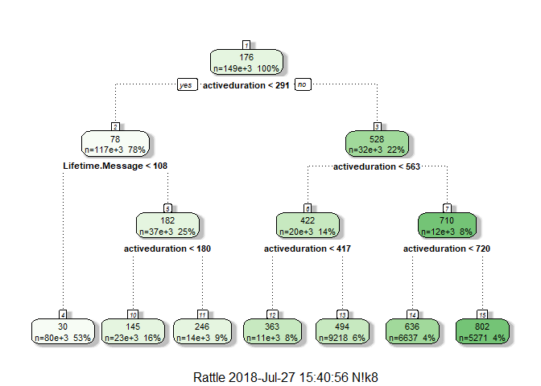

Email Campaign Newsletter Analysis
================
Niket Choudhary
July 12, 2018

Email Campaign Newsletter

``` r
subdata <- read.csv(file.choose(), header = T, na.strings = c("NA",""," ",".")) # choose the subscribers data csv file
```

``` r
nrow(subdata)
```

    ## [1] 705144

``` r
ncol(subdata)
```

    ## [1] 21

``` r
head(subdata)
```

    ##                 Profile.Id        Domain Engagement              Signup
    ## 1 5572fb5592721912198b587b sbcglobal.net hardbounce 2015/06/06 09:53:25
    ## 2 5441111b66dfa5ab01b0a000   hotmail.com     optout 2014/10/17 08:52:43
    ## 3 56cde9d9d9cb94486d8b51d7     yahoo.com     optout 2016/02/24 12:35:21
    ## 4 57e68298d9cb942a708b48db     gmail.com    dormant 2016/09/24 09:41:44
    ## 5 5498bd77f641910f100e23fb sbcglobal.net     optout 2014/12/22 19:55:19
    ## 6 57f84fbad9cb94f1778b50d7   hotmail.com    passive 2016/10/07 21:45:30
    ##   Opens Clicks           Last.Open          Last.Click         Optout.Time
    ## 1    51     11 2016/01/20 00:35:25 2015/08/12 19:50:19                <NA>
    ## 2     2      0 2014/11/21 07:37:15                <NA> 2014/11/21 07:45:29
    ## 3     0      0                <NA>                <NA> 2016/03/02 19:45:14
    ## 4     0      0                <NA>                <NA>                <NA>
    ## 5    30      1 2015/01/06 21:10:26 2015/01/01 21:21:20 2015/01/06 21:11:33
    ## 6    54     29 2017/04/17 15:29:19 2017/04/06 10:34:26                <NA>
    ##         Geolocation.City Geolocation.State Geolocation.Country
    ## 1 El Dorado Hills, CA US             CA US                  US
    ## 2                   <NA>              <NA>                <NA>
    ## 3                   <NA>              <NA>                <NA>
    ## 4                   <NA>              <NA>                <NA>
    ## 5                   <NA>              <NA>                  US
    ## 6      Birmingham, MI US             MI US                  US
    ##   Geolocation.Zip Lifetime.Message Top.Device referral_source first_name
    ## 1        95762 US              169      Other             DMi      Betty
    ## 2            <NA>              203       <NA>        Untagged       <NA>
    ## 3            <NA>               10       <NA>             DMi        Ana
    ## 4            <NA>              257       <NA>        Facebook       <NA>
    ## 5            <NA>               39    Android            <NA>       <NA>
    ## 6        48009 US              235     Chrome      In Book Ad       <NA>
    ##   last_name age gender
    ## 1   Goodwin  NA   <NA>
    ## 2      <NA>  NA   <NA>
    ## 3   Alvarez  NA   <NA>
    ## 4      <NA>  NA   <NA>
    ## 5      <NA>  NA   <NA>
    ## 6      <NA>  NA   <NA>
    ##                                                                                                                                                                       ebb_preferences
    ## 1                                                                  ["bestsellers","mysteries_thrillers_true_crime","science_fiction_fantasy","literary_fiction","general_nonfiction"]
    ## 2                                                                                                                                                                                <NA>
    ## 3                                                                                                                                                                                <NA>
    ## 4                                                                                                                                                   ["bestsellers","book_club_picks"]
    ## 5                                                                                                                                                                                <NA>
    ## 6 ["historical_fiction","literary_fiction","mysteries_thrillers_true_crime","romance","young_adult","biographies_and_memoir","lifestyle_and_cooking","bestsellers","book_club_picks"]

``` r
summary(subdata)
```

    ##                     Profile.Id             Domain      
    ##  539f4216a256ab65720001de:     1   gmail.com  :292168  
    ##  53a30c519dbcd4ed3800026a:     1   yahoo.com  :156392  
    ##  53b2bfdfa256ab243e0004e8:     1   aol.com    : 48256  
    ##  53b2c10ca256ab0f3e000685:     1   hotmail.com: 47714  
    ##  53b2fbbba256abf131000355:     1   comcast.net: 18395  
    ##  53b300c6fdd5ac595400042c:     1   (Other)    :142185  
    ##  (Other)                 :705138   NA's       :    34  
    ##       Engagement                     Signup           Opens         
    ##  disengaged:243353   2017/04/07 15:45:49:  1443   Min.   :    0.00  
    ##  optout    :186133   2016/07/06 08:47:15:  1428   1st Qu.:    1.00  
    ##  dormant   :122557   2017/02/27 15:56:39:  1092   Median :    8.00  
    ##  passive   : 90974   2017/02/06 16:08:53:  1046   Mean   :   78.71  
    ##  active    : 32083   2017/02/23 15:29:05:   995   3rd Qu.:   52.00  
    ##  hardbounce: 27530   2017/04/18 07:49:56:   945   Max.   :48198.00  
    ##  (Other)   :  2514   (Other)            :698195                     
    ##      Clicks                        Last.Open     
    ##  Min.   :     0.00   2017/04/17 15:11:58:    14  
    ##  1st Qu.:     0.00   2017/04/17 15:19:49:    13  
    ##  Median :     0.00   2017/04/17 15:09:27:    12  
    ##  Mean   :    11.16   2017/04/17 15:11:35:    12  
    ##  3rd Qu.:     2.00   2017/04/19 09:02:46:    12  
    ##  Max.   :154125.00   (Other)            :548707  
    ##                      NA's               :156374  
    ##                Last.Click                  Optout.Time    
    ##  2016/01/28 12:28:12:     5   2016/04/14 10:21:45:   204  
    ##  2016/08/25 16:01:41:     5   2016/04/14 10:21:44:   185  
    ##  2016/08/25 16:01:46:     5   2016/04/14 10:21:46:   177  
    ##  2016/08/25 16:01:49:     5   2016/04/14 10:21:41:   169  
    ##  2017/04/18 10:46:26:     5   2016/04/14 10:21:40:   168  
    ##  (Other)            :270041   (Other)            :185185  
    ##  NA's               :435078   NA's               :519056  
    ##         Geolocation.City  Geolocation.State Geolocation.Country
    ##  Houston, TX US :  2328   CA US  : 20271    US     :255894     
    ##  Dallas, TX US  :  2246   FL US  : 19022    CA     :  4402     
    ##  Chicago, IL US :  2098   TX US  : 18583    GB     :   917     
    ##  New York, NY US:  2042   NY US  : 14390    AU     :   693     
    ##  Phoenix, AZ US :  1624   PA US  : 11478    MX     :   355     
    ##  (Other)        :245282   (Other):174660    (Other):  4844     
    ##  NA's           :449524   NA's   :446740    NA's   :438039     
    ##  Geolocation.Zip   Lifetime.Message          Top.Device    
    ##  75270 US:  1559   Min.   :   0.0   iPad          : 45865  
    ##  77002 US:   614   1st Qu.: 113.0   Android       : 44072  
    ##  K2H CA  :   449   Median : 338.0   Chrome        : 43394  
    ##  60602 US:   349   Mean   : 402.7   iPhone        : 38707  
    ##  95103 US:   346   3rd Qu.: 559.0   Android Tablet: 31390  
    ##  (Other) :246782   Max.   :3855.0   (Other)       : 60607  
    ##  NA's    :455045                    NA's          :441109  
    ##    referral_source      first_name        last_name           age        
    ##  DMi       :243435   Mary    :  1987   Smith   :  2663   Min.   :  0.0   
    ##  Facebook  :146656   Linda   :  1978   Johnson :  2149   1st Qu.: 35.0   
    ##  Untagged  : 71084   Jennifer:  1949   Williams:  1949   Median : 47.0   
    ##  LiveIntent: 47852   Lisa    :  1628   Jones   :  1672   Mean   : 46.9   
    ##  torsweeps : 20929   Jessica :  1513   Brown   :  1581   3rd Qu.: 58.0   
    ##  (Other)   :100052   (Other) :273439   (Other) :272418   Max.   :947.0   
    ##  NA's      : 75136   NA's    :422650   NA's    :422712   NA's   :702813  
    ##   gender      
    ##  f   :  2041  
    ##  m   :   292  
    ##  NA's:702811  
    ##               
    ##               
    ##               
    ##               
    ##                                                                                                                                                                                                                                                           ebb_preferences  
    ##  ["bestsellers","book_club_picks","biographies_and_memoir","childrens","general_nonfiction","historical_fiction","history","lifestyle_and_cooking","literary_fiction","mysteries_thrillers_true_crime","poetry","romance","science_fiction_fantasy","young_adult"]: 39045  
    ##  ["childrens","historical_fiction","literary_fiction","mysteries_thrillers_true_crime","romance","science_fiction_fantasy","young_adult","biographies_and_memoir","general_nonfiction","history","lifestyle_and_cooking","poetry","bestsellers","book_club_picks"]: 19907  
    ##  ["bestsellers","biographies_and_memoir","book_club_picks","childrens","general_nonfiction","historical_fiction","history","lifestyle_and_cooking","literary_fiction","mysteries_thrillers_true_crime","poetry","romance","science_fiction_fantasy","young_adult"]:  6861  
    ##  ["romance"]                                                                                                                                                                                                                                                      :  6609  
    ##  ["mysteries_thrillers_true_crime"]                                                                                                                                                                                                                               :  5771  
    ##  (Other)                                                                                                                                                                                                                                                          :341718  
    ##  NA's                                                                                                                                                                                                                                                             :285233

``` r
str(subdata)
```

    ## 'data.frame':    705144 obs. of  21 variables:
    ##  $ Profile.Id         : Factor w/ 705144 levels "539f4216a256ab65720001de",..: 182563 76092 416221 575410 115531 580586 517447 264518 62166 99289 ...
    ##  $ Domain             : Factor w/ 21851 levels "0101press.com",..: 16632 8727 21499 7440 16632 8727 21499 7440 8781 21499 ...
    ##  $ Engagement         : Factor w/ 8 levels "active","disengaged",..: 5 7 7 3 7 8 7 2 5 5 ...
    ##  $ Signup             : Factor w/ 593820 levels "2014/06/16 15:14:30",..: 166407 61497 357109 491293 100629 496457 437719 246076 47875 84488 ...
    ##  $ Opens              : int  51 2 0 0 30 54 16 16 0 0 ...
    ##  $ Clicks             : int  11 0 0 0 1 29 0 0 0 0 ...
    ##  $ Last.Open          : Factor w/ 507871 levels "2014/07/10 12:40:02",..: 86324 11194 NA NA 16146 447201 156939 322770 NA NA ...
    ##  $ Last.Click         : Factor w/ 265929 levels "2014/07/10 13:00:31",..: 38022 NA NA NA 12499 222564 NA NA NA NA ...
    ##  $ Optout.Time        : Factor w/ 182773 levels "2014/07/09 20:01:01",..: NA 9539 69207 NA 13116 NA 94833 NA NA NA ...
    ##  $ Geolocation.City   : Factor w/ 15290 levels "'s-gravenzande, 11 NL",..: 4040 NA NA NA NA 1271 NA NA NA NA ...
    ##  $ Geolocation.State  : Factor w/ 902 levels "00 AI","00 AS",..: 680 NA NA NA NA 794 NA NA NA NA ...
    ##  $ Geolocation.Country: Factor w/ 167 levels "A1","AD","AE",..: 156 NA NA NA 156 156 NA NA NA NA ...
    ##  $ Geolocation.Zip    : Factor w/ 22138 levels "00-343 PL","00002 FI",..: 19892 NA NA NA NA 10744 NA NA NA NA ...
    ##  $ Lifetime.Message   : int  169 203 10 257 39 235 9 632 1 1 ...
    ##  $ Top.Device         : Factor w/ 22 levels "Android","Android Tablet",..: 14 NA NA NA 1 4 NA NA NA NA ...
    ##  $ referral_source    : Factor w/ 75 levels "AdRoll","aramis",..: 13 70 13 21 NA 29 36 13 70 21 ...
    ##  $ first_name         : Factor w/ 47086 levels " Connie",".Jennifer",..: 4476 NA 1853 NA NA NA NA 35999 NA NA ...
    ##  $ last_name          : Factor w/ 82501 levels " Bonham"," burton",..: 28725 NA 1845 NA NA NA NA 20226 NA NA ...
    ##  $ age                : int  NA NA NA NA NA NA NA NA NA NA ...
    ##  $ gender             : Factor w/ 2 levels "f","m": NA NA NA NA NA NA NA NA NA NA ...
    ##  $ ebb_preferences    : Factor w/ 20325 levels "\"Bestsellers\",\"Romance\",\"Literary Fiction\"]",..: 8105 NA NA 5660 NA 16039 12950 10969 NA NA ...

``` r
length(unique(subdata$Profile.Id))
```

    ## [1] 705144

We can consider each Profile.Id to be a unique Subscriber, hence in total we have 705144 subscribers

Convert Signup(Date, Time) to Date, changing data type from factor to date

``` r
subdata$Date <- as.Date(subdata$Signup) # storing in a new column 'Date'
str(subdata$Date)
```

    ##  Date[1:705144], format: "2015-06-06" "2014-10-17" "2016-02-24" "2016-09-24" "2014-12-22" ...

------------------------------------------------------------------------

------------------------------------------------------------------------

``` r
# Let's break the Date column into Year
subdata$Year <- as.numeric(format(subdata$Date, "%Y" ))
str(subdata$Year)
```

    ##  num [1:705144] 2015 2014 2016 2016 2014 ...

``` r
# install.packages('plyr')
library(plyr)
yearcount <- count(subdata, 'Year')
yearcount
```

    ##   Year   freq
    ## 1 2014 124879
    ## 2 2015 195409
    ## 3 2016 299252
    ## 4 2017  85604

``` r
# Plotting above data

# install.packages('ggplot2')
library(ggplot2)

ggplot(yearcount, aes(x = Year, y = freq)) + 
  geom_bar(aes(fill = freq), stat = "identity") +
  xlab("Year") + ylab("Number of Subscribers") + labs(title = "Number of Subscribers per Year") +
  geom_text(aes(label = freq), vjust = -1)
```

 We got most subscribers in the year 2016

``` r
# Let's see referral sources
count(subdata, 'referral_source')
```

    ##     referral_source   freq
    ## 1            AdRoll      5
    ## 2            aramis   2132
    ## 3           bookbub    167
    ## 4           Bookbub      5
    ## 5          Bookpage     50
    ## 6          BookPage   1345
    ## 7          bookriot    214
    ## 8          Bookriot      9
    ## 9    BookRiotSweeps  10598
    ## 10          Bookstr      4
    ## 11            cerkl      1
    ## 12      chickensoup      4
    ## 13              DMi 243435
    ## 14      dmi_qhealth  19352
    ## 15     dunkindonuts      1
    ## 16 Early Bird Books      1
    ## 17        EBB Embed    808
    ## 18            EBBV2      9
    ## 19   Email Campaign     17
    ## 20         facebook    358
    ## 21         Facebook 146656
    ## 22     facebook.com      3
    ## 23   Facebook_Leads    243
    ## 24      FBGiveaways    782
    ## 25            fyntr  13795
    ## 26           google   1156
    ## 27           Google   6171
    ## 28     HumbleBundle   2689
    ## 29       In Book Ad  17859
    ## 30     instafreebie    302
    ## 31      JBF Members     11
    ## 32       litbreaker     28
    ## 33       Litbreaker     17
    ## 34           LitHub     47
    ## 35            Litsy      5
    ## 36       LiveIntent  47852
    ## 37        new value      1
    ## 38       NoiseTrade    188
    ## 39    Off the Shelf     14
    ## 40           optint   2209
    ## 41           Paypal      1
    ## 42        peachtree      2
    ## 43  Permission Data  11216
    ## 44        Pinterest      3
    ## 45    pinterest.com      1
    ## 46        Portalist     33
    ## 47            quora      2
    ## 48        ralph.com      5
    ## 49        ralphtest      1
    ## 50    ReadItForward     86
    ## 51           Reddit      8
    ## 52         Sailthru   2084
    ## 53  Shelf Awareness    695
    ## 54          Shelfie    211
    ## 55 Standard Display      7
    ## 56        SwagBucks    511
    ## 57          Taboola      5
    ## 58         TAFemail      2
    ## 59             test      1
    ## 60             Test      1
    ## 61      The Line Up     16
    ## 62     The Line Up      64
    ## 63       The Lineup      6
    ## 64          Tiburon     23
    ## 65              TLU   2447
    ## 66      tlucheckbox   1251
    ## 67        torsweeps  20929
    ## 68          twitter      1
    ## 69          Twitter     16
    ## 70         Untagged  71084
    ## 71            Viber      1
    ## 72      WarIsBoring     34
    ## 73     WelcomeEmail    694
    ## 74            worth      4
    ## 75       worthbooks     20
    ## 76             <NA>  75136

We can see that bookbub, Bookbub; Bookpage, BookPage; bookriot, Bookriot; google, Google; facebook, Facebook, facebook.com; litbreaker, Litbreaker; Pinterest, pinterest.com; The Line Up, The Line Up, The Lineup ; and twitter, Twitter are counted separately per year, let's rename them

``` r
subdata$referral_source[subdata$referral_source == 'bookbub'] <- 'Bookbub'
subdata$referral_source[subdata$referral_source == 'Bookpage'] <- 'BookPage'
subdata$referral_source[subdata$referral_source == 'bookriot'] <- 'Bookriot'
subdata$referral_source[subdata$referral_source == 'google'] <- 'Google'
subdata$referral_source[subdata$referral_source == 'facebook'] <- 'Facebook'
subdata$referral_source[subdata$referral_source == 'facebook.com'] <- 'Facebook'
subdata$referral_source[subdata$referral_source == 'litbreaker'] <- 'Litbreaker'
subdata$referral_source[subdata$referral_source == 'pinterest.com'] <- 'Pinterest'
subdata$referral_source[subdata$referral_source == 'The Line Up '] <- 'The Lineup'
subdata$referral_source[subdata$referral_source == 'The Line Up'] <- 'The Lineup'
subdata$referral_source[subdata$referral_source == 'twitter'] <- 'Twitter'
```

Count number of subscribers we acquired each year by referral source

``` r
y <- aggregate(Profile.Id ~ referral_source + Year, data = subdata, length)
```

``` r
y1 <- y[with(y,order(-Profile.Id)),]
y1 <- y1[1:10,]
y1
```

    ##     referral_source Year Profile.Id
    ## 83              DMi 2016     132843
    ## 48              DMi 2015     109727
    ## 39         Untagged 2014      71084
    ## 89         Facebook 2016      46124
    ## 52         Facebook 2015      43695
    ## 11         Facebook 2014      36497
    ## 101      LiveIntent 2016      33947
    ## 136        Facebook 2017      20701
    ## 154       torsweeps 2017      18649
    ## 84      dmi_qhealth 2016      18536

``` r
ggplot(y1, aes(x = referral_source, y = Profile.Id)) + 
  geom_bar(aes(fill = y1$Year), stat = "identity") +
  xlab("Source") + ylab("Number of Subscribers") + labs(title = "Number of Subscribers per Year") +
  #geom_text(aes(label = Profile.Id), vjust = -1) +
  theme(axis.text.x = element_text(angle = 65, vjust = 0.6))
```


``` r
# Let's break the Date column into Month
subdata$Month <- as.factor(format(subdata$Date, "%B" ))
```

Count number of subscribers we acquired each month by referral source

``` r
z <- aggregate(Profile.Id ~ referral_source + factor(Month, levels = month.name), data = subdata, length)
```

``` r
z1 <- z[with(z,order(-Profile.Id)),]
z1 <- z1[1:10,]
z1
```

    ##     referral_source factor(Month, levels = month.name) Profile.Id
    ## 6               DMi                            January      43393
    ## 288             DMi                          September      34481
    ## 253             DMi                             August      31607
    ## 81              DMi                              March      30295
    ## 43              DMi                           February      30243
    ## 10         Facebook                            January      25875
    ## 317        Untagged                          September      25653
    ## 405        Facebook                           December      24926
    ## 187             DMi                               June      23126
    ## 355        Untagged                            October      21849

``` r
ggplot(z1, aes(x = referral_source, y = Profile.Id)) + 
  geom_bar(aes(fill = z1$`factor(Month, levels = month.name)`), stat = "identity") +
  xlab("Source") + ylab("Number of Subscribers") + labs(title = "Number of Subscribers per Month") +
  #geom_text(aes(label = Profile.Id), vjust = -1) +
  theme(axis.text.x = element_text(angle = 65, vjust = 0.6))
```

 In the month of January, DMi gave us 43393 suscribers

``` r
x <- aggregate(Profile.Id ~ referral_source + Year + factor(Month, levels = month.name), data = subdata, length)
```

``` r
x1 <- x[with(x,order(-Profile.Id)),]
x1 <- x1[1:10,]
x1
```

    ##     referral_source Year factor(Month, levels = month.name) Profile.Id
    ## 29              DMi 2016                            January      43233
    ## 557             DMi 2015                          September      34250
    ## 479             DMi 2015                             August      31466
    ## 172             DMi 2016                              March      30259
    ## 102             DMi 2016                           February      30156
    ## 550        Untagged 2014                          September      25653
    ## 339             DMi 2015                               June      22997
    ## 625        Untagged 2014                            October      21849
    ## 756        Facebook 2014                           December      18979
    ## 8          Facebook 2015                            January      17053

43233 subscribers were acquired in the month of January, 2016, via DMi.

------------------------------------------------------------------------

------------------------------------------------------------------------

Let us create a new data frame consisting of subscriber and their preferences

``` r
attach(subdata)
subdata_ebb <- data.frame(Profile.Id, ebb_preferences)
detach(subdata)
```

``` r
# Now let's remove square brackets and quotations from preferences

subdata_ebb$ebb_preferences <- paste0("", gsub("[][]", "", subdata_ebb$ebb_preferences), "") # removing square brackets

subdata_ebb$ebb_preferences <- paste0("", gsub('""', "", subdata_ebb$ebb_preferences), "") # removing quotations
```

``` r
subdata_ebb$ebb_preferences <- sapply(subdata_ebb$ebb_preferences, function(x) gsub("\"", "", x)) # remove \" from preferences 

subdata_ebb$ebb_preferences <- as.character(subdata_ebb$ebb_preferences) # store this as character
```

``` r
# Let's see total count of preferences per subscriber
library(stringi)
subdata_ebb$ebb_preferences_count <- stri_count_words(subdata_ebb$ebb_preferences)
```

``` r
# The missing values should be replaced with maximum preferences number, let's find that
summary(as.factor(subdata_ebb$ebb_preferences_count))
```

    ##      0      1      2      3      4      5      6      7      8      9 
    ##      7 318557  30035  36266  32807  29289  26739  25660  26556  28659 
    ##     10     11     12     13     14     16 
    ##  26501  24256  19495  14501  65814      2

We see that most of the preferences are 14(only 2 values for 16 so we exclude it)

``` r
# Fill empty values in preferences with 14
subdata_ebb$ebb_preferences_count[subdata_ebb$ebb_preferences == 'NA'] <- 14
```

``` r
# plot above data

ggplot(subdata_ebb, aes(ebb_preferences_count)) +
  geom_histogram() +
  xlab("Preferences") + ylab("Number of Subscribers") + labs(title = "Number of Subscribers")
```

    ## `stat_bin()` using `bins = 30`. Pick better value with `binwidth`.

 Most subscribers are subscribing to all 14 preferences. It might be because most people prefer default selection.

------------------------------------------------------------------------

------------------------------------------------------------------------

``` r
# Let's store preferences into a list
preferences <- strsplit(subdata_ebb$ebb_preferences, split = ",", fixed = TRUE)
# head(preferences)

preferences_unlist <- unlist(preferences)
# head(preferences_unlist, 10)

unique(preferences_unlist)
```

    ##   [1] "bestsellers"                    "mysteries_thrillers_true_crime"
    ##   [3] "science_fiction_fantasy"        "literary_fiction"              
    ##   [5] "general_nonfiction"             "NA"                            
    ##   [7] "book_club_picks"                "historical_fiction"            
    ##   [9] "romance"                        "young_adult"                   
    ##  [11] "biographies_and_memoir"         "lifestyle_and_cooking"         
    ##  [13] "childrens"                      "history"                       
    ##  [15] "poetry"                         "mysteries_thrillers_"          
    ##  [17] "romanc"                         "general_nonficti"              
    ##  [19] "mysteries_thri"                 "you"                           
    ##  [21] "science_fiction_fanta"          "science_fiction_"              
    ##  [23] "hist"                           "science_fiction_fantas"        
    ##  [25] "youn"                           "mysteries_thrillers_true_c"    
    ##  [27] "y"                              "science_fiction_fa"            
    ##  [29] "poet"                           "po"                            
    ##  [31] "scienc"                         "yo"                            
    ##  [33] "young_"                         "lifestyle_and_co"              
    ##  [35] "scien"                          "science_fict"                  
    ##  [37] "sci"                            "lifestyl"                      
    ##  [39] "roma"                           "science_ficti"                 
    ##  [41] "ro"                             "roman"                         
    ##  [43] "general_nonfictio"              "young"                         
    ##  [45] "science_fictio"                 "science_"                      
    ##  [47] "science_fiction_fant"           "mysteries_thrillers_true_cr"   
    ##  [49] "young_adu"                      "science"                       
    ##  [51] "mysteries_thrillers_tru"        "young_ad"                      
    ##  [53] "young_adul"                     "poetr"                         
    ##  [55] "mysteries_thrillers_true_crim"  "science_fiction_f"             
    ##  [57] "gener"                          "rom"                           
    ##  [59] "g"                              "mysteries_thrillers_t"         
    ##  [61] "mysteries_th"                   "science_fi"                    
    ##  [63] "s"                              "p"                             
    ##  [65] "science_fiction_fan"            "History"                       
    ##  [67] "General Nonfiction"             "Children's"                    
    ##  [69] "Romance"                        "Young Adult"                   
    ##  [71] "Historical Fiction"             "general_n"                     
    ##  [73] "sc"                             "childre"                       
    ##  [75] "science_fiction"                "general_nonfi"                 
    ##  [77] "r"                              "lifestyle_and_cooki"           
    ##  [79] "science_fic"                    "poe"                           
    ##  [81] "general_no"                     "mysteries_thrill"              
    ##  [83] "general_nonfic"                 "scie"                          
    ##  [85] "science_f"                      "genera"                        
    ##  [87] "literary_fic"                   "chi"                           
    ##  [89] "chil"                           "young_a"                       
    ##  [91] "ge"                             "c"                             
    ##  [93] "mysteries_thrillers_tr"         "life"                          
    ##  [95] "children"                       "ScienceFiction"                
    ##  [97] "Bestsellers"                    "null"                          
    ##  [99] "Science Fiction & Fantasy"      "mysteries_thrillers_true_cri"  
    ## [101] "general_nonf"                   "gen"                           
    ## [103] "general_"                       "lifestyle_and_c"               
    ## [105] "lifestyle_and"                  "general_non"                   
    ## [107] "childr"                         "ch"                            
    ## [109] "lifestyle_an"                   "child"                         
    ## [111] "lifestyle_and_cookin"           "gene"                          
    ## [113] "Literary Fiction"               "Biography and Memoir"          
    ## [115] "general_nonfict"                "Mysteries"                     
    ## [117] " Thrillers"                     " & True Crime"                 
    ## [119] " Thrillers & True Crime"        "someEBBPref"                   
    ## [121] "Lifestyle and Cooking"          "Poetry"                        
    ## [123] ""

We have repetitions here, Let us write down the above list without repetitions and significant preferences bestsellers mysteries\_thrillers\_true\_crime science\_fiction\_fantasy literary\_fiction general\_nonfiction book\_club\_picks historical\_fiction romance young\_adult biographies\_and\_memoir lifestyle\_and\_cooking childrens history poetry

We can also see that there are characters y, g, s, p, r, c which in themself do not signify any preference, so we check and drop them

``` r
which(preferences_unlist == "y")
```

    ##  [1]    9006  143312  286912  365405  465488  483784  497426  538954
    ##  [9]  589081  593034  614938  628426  642067  749134  767544  832235
    ## [17]  851308  869730  915719  947259  968635 1003413 1025742 1033008
    ## [25] 1101850 1112233 1131918 1213165 1220613 1246426 1357674 1384929
    ## [33] 1416850 1520314 1542661 1556394 1588104 1634113 1651756 1679796
    ## [41] 1709407 1758462 1769722 1773386 1788792 1894435 1914599 1956523
    ## [49] 1959865 1973000 1981924 2221795 2236944 2265651 2356660 2368875
    ## [57] 2383356 2411042 2427554 2480254 2532792 2611566 2685209 2790593
    ## [65] 2818580 2916982 2918390 2933006 2933914 2956260 2973032 2977901
    ## [73] 2987846 3028387 3122876 3129410 3276839 3367384

``` r
which(preferences_unlist == "g")
```

    ##  [1]   62909  203421  579843 1780677 2001154 2005426 2247205 2278021
    ##  [9] 2437267 2755276

``` r
which(preferences_unlist == "s")
```

    ##  [1]   77876  109024  164151  212281  234094  255689  342216  357967
    ##  [9]  471670  576162  640450  728521 1020886 1022035 1049130 1140165
    ## [17] 1152231 1477817 1511421 1529646 1658757 1825786 1831427 1930225
    ## [25] 2073050 2083411 2148628 2243826 2376436 2396210 2423567 2467782
    ## [33] 2565696 2655593 2723918 2772430 2983514 2991624 3004482 3029191

``` r
which(preferences_unlist == "p")
```

    ##  [1]   81937  188277  533156  655946  852211 1685998 2065580 2096973
    ##  [9] 2223186 2564666 2609015 2911678 2991383 3010160

``` r
which(preferences_unlist == "r")
```

    ##  [1]  104019  163410  187929  188562  296344  406778  409721  418828
    ##  [9]  498546  579077  611710  640325  723335  747176  771377  817368
    ## [17]  929777  947825  992712  994319 1022765 1059707 1462142 1531353
    ## [25] 1546775 1562972 1600972 1607456 1619046 1621721 1654238 1705368
    ## [33] 1727175 1832016 1850662 1889489 1904579 1931668 2047834 2138427
    ## [41] 2178499 2557592 2795140 2871701 2873264 2885740 2892100 2917110
    ## [49] 3023617 3314463

``` r
which(preferences_unlist == "c")
```

    ## [1]  308474 1185638 1280567 2533429 2623631

There are not a whole lot of them, so we will notinclude them

Let us match the pattern in preferences and encode them into binary columns

``` r
subdata_ebb$bestsellers <- ifelse(grepl("bestsellers", subdata_ebb$ebb_preferences, fixed = TRUE),1,0)
subdata_ebb$mysteries <- ifelse(grepl("mysteries", subdata_ebb$ebb_preferences, fixed = TRUE),1,0)
subdata_ebb$science_fiction <- ifelse(grepl("sc", subdata_ebb$ebb_preferences, fixed = TRUE),1,0)
subdata_ebb$lit_fiction <- ifelse(grepl("literary_fic", subdata_ebb$ebb_preferences, fixed = TRUE),1,0)
subdata_ebb$general_nonfiction <- ifelse(grepl("ge", subdata_ebb$ebb_preferences, fixed = TRUE),1,0)
subdata_ebb$book_club_picks <- ifelse(grepl("book_club_picks", subdata_ebb$ebb_preferences, fixed = TRUE),1,0)
subdata_ebb$historical_fiction <- ifelse(grepl("hist", subdata_ebb$ebb_preferences, fixed = TRUE),1,0)
subdata_ebb$romance <- ifelse(grepl("ro", subdata_ebb$ebb_preferences, fixed = TRUE),1,0)
subdata_ebb$young_adult <- ifelse(grepl("yo", subdata_ebb$ebb_preferences, fixed = TRUE),1,0)
subdata_ebb$bio_memoirs <- ifelse(grepl("bio", subdata_ebb$ebb_preferences, fixed = TRUE),1,0)
subdata_ebb$lifestyle_cooking<- ifelse(grepl("life", subdata_ebb$ebb_preferences, fixed = TRUE),1,0)
subdata_ebb$childrens <- ifelse(grepl("ch", subdata_ebb$ebb_preferences, fixed = TRUE),1,0)
subdata_ebb$history<- ifelse(grepl("history", subdata_ebb$ebb_preferences, fixed = TRUE),1,0)
subdata_ebb$poetry <- ifelse(grepl("po", subdata_ebb$ebb_preferences, fixed = TRUE),1,0)
```

``` r
head(subdata_ebb)
```

    ##                 Profile.Id
    ## 1 5572fb5592721912198b587b
    ## 2 5441111b66dfa5ab01b0a000
    ## 3 56cde9d9d9cb94486d8b51d7
    ## 4 57e68298d9cb942a708b48db
    ## 5 5498bd77f641910f100e23fb
    ## 6 57f84fbad9cb94f1778b50d7
    ##                                                                                                                                                   ebb_preferences
    ## 1                                                          bestsellers,mysteries_thrillers_true_crime,science_fiction_fantasy,literary_fiction,general_nonfiction
    ## 2                                                                                                                                                              NA
    ## 3                                                                                                                                                              NA
    ## 4                                                                                                                                     bestsellers,book_club_picks
    ## 5                                                                                                                                                              NA
    ## 6 historical_fiction,literary_fiction,mysteries_thrillers_true_crime,romance,young_adult,biographies_and_memoir,lifestyle_and_cooking,bestsellers,book_club_picks
    ##   ebb_preferences_count bestsellers mysteries science_fiction lit_fiction
    ## 1                     5           1         1               1           1
    ## 2                    14           0         0               0           0
    ## 3                    14           0         0               0           0
    ## 4                     2           1         0               0           0
    ## 5                    14           0         0               0           0
    ## 6                     9           1         1               0           1
    ##   general_nonfiction book_club_picks historical_fiction romance
    ## 1                  1               0                  0       0
    ## 2                  0               0                  0       0
    ## 3                  0               0                  0       0
    ## 4                  0               1                  0       0
    ## 5                  0               0                  0       0
    ## 6                  0               1                  1       1
    ##   young_adult bio_memoirs lifestyle_cooking childrens history poetry
    ## 1           0           0                 0         0       0      0
    ## 2           0           0                 0         0       0      0
    ## 3           0           0                 0         0       0      0
    ## 4           0           0                 0         0       0      0
    ## 5           0           0                 0         0       0      0
    ## 6           1           1                 1         0       0      0

------------------------------------------------------------------------

### Predictive Model

Let us prepare our data Let's again look at all the columns we got

``` r
colnames(subdata)
```

    ##  [1] "Profile.Id"          "Domain"              "Engagement"         
    ##  [4] "Signup"              "Opens"               "Clicks"             
    ##  [7] "Last.Open"           "Last.Click"          "Optout.Time"        
    ## [10] "Geolocation.City"    "Geolocation.State"   "Geolocation.Country"
    ## [13] "Geolocation.Zip"     "Lifetime.Message"    "Top.Device"         
    ## [16] "referral_source"     "first_name"          "last_name"          
    ## [19] "age"                 "gender"              "ebb_preferences"    
    ## [22] "Date"                "Year"                "Month"

``` r
colnames(subdata_ebb)
```

    ##  [1] "Profile.Id"            "ebb_preferences"      
    ##  [3] "ebb_preferences_count" "bestsellers"          
    ##  [5] "mysteries"             "science_fiction"      
    ##  [7] "lit_fiction"           "general_nonfiction"   
    ##  [9] "book_club_picks"       "historical_fiction"   
    ## [11] "romance"               "young_adult"          
    ## [13] "bio_memoirs"           "lifestyle_cooking"    
    ## [15] "childrens"             "history"              
    ## [17] "poetry"

Domain and Engagement are irrelevant; Geolocation, Age, Gender, TopDevice, referral source have too many missing values, so we will not consider them

For predicting when people willl opt-out of the newsletter we will only be needing significant and related variables. Let's create a new dataframe and store all the significant columns which we are going to consider for prediction

``` r
attach(subdata)
optoutprediction <- data.frame(subdata_ebb, Year, Date, Opens, Clicks, Lifetime.Message, Signup, Last.Open, Optout.Time)
detach(subdata)
```

Let's look at the amount of data missing in Optout Time

``` r
sum(is.na(optoutprediction$Optout.Time))
```

    ## [1] 519056

We will drop these rows

``` r
optoutprediction <- optoutprediction[!is.na(optoutprediction$Optout.Time), ]
```

``` r
nrow(optoutprediction)
```

    ## [1] 186088

We are left with 186088 rows only

``` r
optoutprediction$optoutduration <- difftime(optoutprediction$Optout.Time ,optoutprediction$Signup , units = c("days"))
optoutprediction$activeduration <- difftime(optoutprediction$Last.Open ,optoutprediction$Signup , units = c("days"))
```

``` r
max(optoutprediction$optoutduration)
```

    ## Time difference of 1014.963 days

Also convert date into month

``` r
optoutprediction$Month <- as.factor(format(optoutprediction$Date, "%m" ))
```

ebb\_preferences, Date, Signup, Last.Open, Optout.Time is irrelevant, we will drop it

``` r
optoutprediction$ebb_preferences <- NULL
optoutprediction$Date <- NULL
optoutprediction$Signup <- NULL
optoutprediction$Last.Open <- NULL
optoutprediction$Optout.Time <- NULL
```

Let's look at the structure of our new dataset

``` r
str(optoutprediction)
```

    ## 'data.frame':    186088 obs. of  23 variables:
    ##  $ Profile.Id           : Factor w/ 705144 levels "539f4216a256ab65720001de",..: 76092 416221 115531 517447 111409 290464 370333 25730 355790 545522 ...
    ##  $ ebb_preferences_count: num  14 14 14 12 10 14 8 14 6 14 ...
    ##  $ bestsellers          : num  0 0 0 1 1 1 0 0 1 1 ...
    ##  $ mysteries            : num  0 0 0 0 1 1 1 0 1 1 ...
    ##  $ science_fiction      : num  0 0 0 1 1 1 1 0 0 1 ...
    ##  $ lit_fiction          : num  0 0 0 1 1 1 1 0 0 1 ...
    ##  $ general_nonfiction   : num  0 0 0 1 1 1 0 0 1 1 ...
    ##  $ book_club_picks      : num  0 0 0 1 1 1 0 0 1 1 ...
    ##  $ historical_fiction   : num  0 0 0 1 1 1 1 0 1 1 ...
    ##  $ romance              : num  0 0 0 0 0 1 1 0 0 1 ...
    ##  $ young_adult          : num  0 0 0 1 1 1 0 0 0 1 ...
    ##  $ bio_memoirs          : num  0 0 0 1 0 1 0 0 1 1 ...
    ##  $ lifestyle_cooking    : num  0 0 0 1 1 1 1 0 0 1 ...
    ##  $ childrens            : num  0 0 0 1 0 1 0 0 0 1 ...
    ##  $ history              : num  0 0 0 1 1 1 1 0 1 1 ...
    ##  $ poetry               : num  0 0 0 1 0 1 1 0 0 1 ...
    ##  $ Year                 : num  2014 2016 2014 2016 2014 ...
    ##  $ Opens                : int  2 0 30 16 31 20 0 56 29 51 ...
    ##  $ Clicks               : int  0 0 1 0 5 2 0 1 51 0 ...
    ##  $ Lifetime.Message     : int  203 10 39 9 438 20 20 859 173 33 ...
    ##  $ optoutduration       :Class 'difftime'  atomic [1:186088] 35 7.3 15.1 5.4 500 ...
    ##   .. ..- attr(*, "units")= chr "days"
    ##  $ activeduration       :Class 'difftime'  atomic [1:186088] 35 NA 15.1 5.4 500 ...
    ##   .. ..- attr(*, "units")= chr "days"
    ##  $ Month                : Factor w/ 12 levels "01","02","03",..: 10 2 12 5 12 10 1 8 1 7 ...

Looks like we have to convert some of the data types

``` r
optoutprediction$bestsellers <- as.factor(optoutprediction$bestsellers)
optoutprediction$mysteries <- as.factor(optoutprediction$mysteries)
optoutprediction$science_fiction <- as.factor(optoutprediction$science_fiction)
optoutprediction$lit_fiction <- as.factor(optoutprediction$lit_fiction)
optoutprediction$general_nonfiction <- as.factor(optoutprediction$general_nonfiction)
optoutprediction$book_club_picks <- as.factor(optoutprediction$book_club_picks)
optoutprediction$historical_fiction <- as.factor(optoutprediction$historical_fiction)
optoutprediction$romance <- as.factor(optoutprediction$romance)
optoutprediction$young_adult <- as.factor(optoutprediction$young_adult)
optoutprediction$bio_memoirs <- as.factor(optoutprediction$bio_memoirs)
optoutprediction$lifestyle_cooking <- as.factor(optoutprediction$lifestyle_cooking)
optoutprediction$childrens <- as.factor(optoutprediction$childrens)
optoutprediction$history<- as.factor(optoutprediction$history)
optoutprediction$poetry <- as.factor(optoutprediction$poetry)
optoutprediction$Year <- as.factor(optoutprediction$Year)
optoutprediction$optoutduration <- as.numeric(optoutprediction$optoutduration)
optoutprediction$activeduration <- as.numeric(optoutprediction$activeduration)
```

Let's look again

``` r
str(optoutprediction)
```

    ## 'data.frame':    186088 obs. of  23 variables:
    ##  $ Profile.Id           : Factor w/ 705144 levels "539f4216a256ab65720001de",..: 76092 416221 115531 517447 111409 290464 370333 25730 355790 545522 ...
    ##  $ ebb_preferences_count: num  14 14 14 12 10 14 8 14 6 14 ...
    ##  $ bestsellers          : Factor w/ 2 levels "0","1": 1 1 1 2 2 2 1 1 2 2 ...
    ##  $ mysteries            : Factor w/ 2 levels "0","1": 1 1 1 1 2 2 2 1 2 2 ...
    ##  $ science_fiction      : Factor w/ 2 levels "0","1": 1 1 1 2 2 2 2 1 1 2 ...
    ##  $ lit_fiction          : Factor w/ 2 levels "0","1": 1 1 1 2 2 2 2 1 1 2 ...
    ##  $ general_nonfiction   : Factor w/ 2 levels "0","1": 1 1 1 2 2 2 1 1 2 2 ...
    ##  $ book_club_picks      : Factor w/ 2 levels "0","1": 1 1 1 2 2 2 1 1 2 2 ...
    ##  $ historical_fiction   : Factor w/ 2 levels "0","1": 1 1 1 2 2 2 2 1 2 2 ...
    ##  $ romance              : Factor w/ 2 levels "0","1": 1 1 1 1 1 2 2 1 1 2 ...
    ##  $ young_adult          : Factor w/ 2 levels "0","1": 1 1 1 2 2 2 1 1 1 2 ...
    ##  $ bio_memoirs          : Factor w/ 2 levels "0","1": 1 1 1 2 1 2 1 1 2 2 ...
    ##  $ lifestyle_cooking    : Factor w/ 2 levels "0","1": 1 1 1 2 2 2 2 1 1 2 ...
    ##  $ childrens            : Factor w/ 2 levels "0","1": 1 1 1 2 1 2 1 1 1 2 ...
    ##  $ history              : Factor w/ 2 levels "0","1": 1 1 1 2 2 2 2 1 2 2 ...
    ##  $ poetry               : Factor w/ 2 levels "0","1": 1 1 1 2 1 2 2 1 1 2 ...
    ##  $ Year                 : Factor w/ 4 levels "2014","2015",..: 1 3 1 3 1 2 3 1 3 3 ...
    ##  $ Opens                : int  2 0 30 16 31 20 0 56 29 51 ...
    ##  $ Clicks               : int  0 0 1 0 5 2 0 1 51 0 ...
    ##  $ Lifetime.Message     : int  203 10 39 9 438 20 20 859 173 33 ...
    ##  $ optoutduration       : num  35 7.3 15.1 5.4 500 ...
    ##  $ activeduration       : num  35 NA 15.1 5.4 500 ...
    ##  $ Month                : Factor w/ 12 levels "01","02","03",..: 10 2 12 5 12 10 1 8 1 7 ...

Before applying any model, let's check for missing values

``` r
summary(optoutprediction)
```

    ##                     Profile.Id     ebb_preferences_count bestsellers
    ##  53a30c519dbcd4ed3800026a:     1   Min.   : 1.00         0:96698    
    ##  53b300c6fdd5ac595400042c:     1   1st Qu.: 7.00         1:89390    
    ##  53b31af8fdd5ac955c0000c8:     1   Median :14.00                    
    ##  53b32b8f9dbcd40e6300061d:     1   Mean   :10.38                    
    ##  53b3481e9dbcd4a063000441:     1   3rd Qu.:14.00                    
    ##  53b38b06fdd5acba2e000003:     1   Max.   :14.00                    
    ##  (Other)                 :186082                                    
    ##  mysteries  science_fiction lit_fiction general_nonfiction book_club_picks
    ##  0:116409   0:128347        0:127818    0:130183           0:115072       
    ##  1: 69679   1: 57741        1: 58270    1: 55905           1: 71016       
    ##                                                                           
    ##                                                                           
    ##                                                                           
    ##                                                                           
    ##                                                                           
    ##  historical_fiction romance    young_adult bio_memoirs lifestyle_cooking
    ##  0:115193           0:126146   0:134181    0:128159    0:129350         
    ##  1: 70895           1: 59942   1: 51907    1: 57929    1: 56738         
    ##                                                                         
    ##                                                                         
    ##                                                                         
    ##                                                                         
    ##                                                                         
    ##  childrens  history    poetry       Year           Opens         
    ##  0:138967   0:128971   0:141320   2014:45904   Min.   :    0.00  
    ##  1: 47121   1: 57117   1: 44768   2015:49996   1st Qu.:    3.00  
    ##                                   2016:73111   Median :   12.00  
    ##                                   2017:17077   Mean   :   56.46  
    ##                                                3rd Qu.:   47.00  
    ##                                                Max.   :38853.00  
    ##                                                                  
    ##      Clicks         Lifetime.Message optoutduration    activeduration   
    ##  Min.   :   0.000   Min.   :   0     Min.   :-794.90   Min.   :-794.90  
    ##  1st Qu.:   0.000   1st Qu.:  16     1st Qu.:  13.02   1st Qu.:  13.03  
    ##  Median :   0.000   Median :  87     Median :  74.30   Median :  72.83  
    ##  Mean   :   6.107   Mean   : 224     Mean   : 176.07   Mean   : 175.07  
    ##  3rd Qu.:   3.000   3rd Qu.: 313     3rd Qu.: 269.05   3rd Qu.: 266.65  
    ##  Max.   :5101.000   Max.   :1855     Max.   :1014.96   Max.   :1014.93  
    ##                                                        NA's   :11815    
    ##      Month      
    ##  01     :22790  
    ##  09     :22236  
    ##  02     :22225  
    ##  08     :18670  
    ##  12     :16140  
    ##  03     :14849  
    ##  (Other):69178

optoutduration and activeduration have negative values which we will make positive, and activeduration has missing values

``` r
optoutprediction$optoutduration <- abs(optoutprediction$optoutduration)
optoutprediction$activeduration <- abs(optoutprediction$activeduration)
```

``` r
summary(optoutprediction$activeduration)
```

    ##    Min. 1st Qu.  Median    Mean 3rd Qu.    Max.    NA's 
    ##    0.00   13.03   72.84  175.09  266.67 1014.93   11815

These missing values can be replace by median

``` r
optoutprediction$activeduration[is.na(optoutprediction$activeduration)] <- median(optoutprediction$activeduration, na.rm = TRUE)
```

``` r
summary(optoutprediction$activeduration) # Now it' good
```

    ##    Min. 1st Qu.  Median    Mean 3rd Qu.    Max. 
    ##    0.00   14.92   72.84  168.60  246.56 1014.93

#### Prediction

``` r
label <- optoutprediction$optoutduration # our variable for prediction
```

``` r
set.seed(1234)
oneortwo <- sample(1:2 , length(optoutprediction$Profile.Id), replace = TRUE, prob=c(0.8, 0.2)) # generating random values and storing them
```

``` r
# create train data frame
train <- optoutprediction[oneortwo == 1, ]

# create test data frame
test <- optoutprediction[oneortwo == 2, ]
```

##### Let's apply Linear Regression model

``` r
lm_fit <- step(lm(optoutduration ~. -Profile.Id, data = train), direction = "both")
```

    ## Start:  AIC=1168886
    ## optoutduration ~ (Profile.Id + ebb_preferences_count + bestsellers + 
    ##     mysteries + science_fiction + lit_fiction + general_nonfiction + 
    ##     book_club_picks + historical_fiction + romance + young_adult + 
    ##     bio_memoirs + lifestyle_cooking + childrens + history + poetry + 
    ##     Year + Opens + Clicks + Lifetime.Message + activeduration + 
    ##     Month) - Profile.Id
    ## 
    ##                         Df Sum of Sq        RSS     AIC
    ## - poetry                 1       135  379693687 1168884
    ## - book_club_picks        1       697  379694249 1168884
    ## - Clicks                 1      1355  379694907 1168884
    ## - young_adult            1      1426  379694977 1168884
    ## - lifestyle_cooking      1      1615  379695167 1168884
    ## - science_fiction        1      1764  379695316 1168884
    ## - history                1      2810  379696361 1168885
    ## - romance                1      3918  379697470 1168885
    ## - historical_fiction     1      3919  379697471 1168885
    ## - general_nonfiction     1      4436  379697988 1168885
    ## <none>                                379693552 1168886
    ## - mysteries              1      5609  379699161 1168886
    ## - bestsellers            1      6237  379699788 1168886
    ## - childrens              1      6561  379700113 1168886
    ## - bio_memoirs            1      8404  379701956 1168887
    ## - lit_fiction            1     11380  379704931 1168888
    ## - ebb_preferences_count  1     35973  379729525 1168898
    ## - Opens                  1    380425  380073977 1169033
    ## - Month                 11  21679962  401373514 1177139
    ## - Year                   3  32268858  411962410 1181035
    ## - Lifetime.Message       1 124870776  504564328 1211257
    ## - activeduration         1 819585299 1199278850 1340281
    ## 
    ## Step:  AIC=1168884
    ## optoutduration ~ ebb_preferences_count + bestsellers + mysteries + 
    ##     science_fiction + lit_fiction + general_nonfiction + book_club_picks + 
    ##     historical_fiction + romance + young_adult + bio_memoirs + 
    ##     lifestyle_cooking + childrens + history + Year + Opens + 
    ##     Clicks + Lifetime.Message + activeduration + Month
    ## 
    ##                         Df Sum of Sq        RSS     AIC
    ## - book_club_picks        1       717  379694404 1168882
    ## - Clicks                 1      1352  379695039 1168882
    ## - young_adult            1      1604  379695291 1168882
    ## - science_fiction        1      1670  379695357 1168882
    ## - lifestyle_cooking      1      1781  379695468 1168882
    ## - history                1      2701  379696388 1168883
    ## - romance                1      3822  379697509 1168883
    ## - historical_fiction     1      3870  379697557 1168883
    ## - general_nonfiction     1      4519  379698206 1168883
    ## <none>                                379693687 1168884
    ## - mysteries              1      5507  379699194 1168884
    ## - bestsellers            1      6251  379699938 1168884
    ## - childrens              1      6708  379700395 1168884
    ## - bio_memoirs            1      8496  379702183 1168885
    ## + poetry                 1       135  379693552 1168886
    ## - lit_fiction            1     11487  379705174 1168886
    ## - ebb_preferences_count  1     36033  379729720 1168896
    ## - Opens                  1    380299  380073986 1169031
    ## - Month                 11  21680861  401374548 1177137
    ## - Year                   3  32269449  411963136 1181034
    ## - Lifetime.Message       1 124871866  504565553 1211255
    ## - activeduration         1 819595211 1199288899 1340280
    ## 
    ## Step:  AIC=1168882
    ## optoutduration ~ ebb_preferences_count + bestsellers + mysteries + 
    ##     science_fiction + lit_fiction + general_nonfiction + historical_fiction + 
    ##     romance + young_adult + bio_memoirs + lifestyle_cooking + 
    ##     childrens + history + Year + Opens + Clicks + Lifetime.Message + 
    ##     activeduration + Month
    ## 
    ##                         Df Sum of Sq        RSS     AIC
    ## - Clicks                 1      1333  379695737 1168880
    ## - science_fiction        1      1649  379696053 1168881
    ## - young_adult            1      1694  379696098 1168881
    ## - lifestyle_cooking      1      1918  379696322 1168881
    ## - history                1      2829  379697233 1168881
    ## - romance                1      3724  379698128 1168881
    ## - historical_fiction     1      4121  379698525 1168882
    ## - general_nonfiction     1      5019  379699423 1168882
    ## <none>                                379694404 1168882
    ## - mysteries              1      5604  379700008 1168882
    ## - childrens              1      6554  379700958 1168883
    ## - bio_memoirs            1      8772  379703176 1168883
    ## + book_club_picks        1       717  379693687 1168884
    ## + poetry                 1       155  379694249 1168884
    ## - bestsellers            1     10379  379704783 1168884
    ## - lit_fiction            1     12804  379707208 1168885
    ## - ebb_preferences_count  1     35380  379729784 1168894
    ## - Opens                  1    381424  380075828 1169030
    ## - Month                 11  21715984  401410388 1177148
    ## - Year                   3  32994242  412688646 1181294
    ## - Lifetime.Message       1 125027291  504721695 1211299
    ## - activeduration         1 820653894 1200348298 1340410
    ## 
    ## Step:  AIC=1168880
    ## optoutduration ~ ebb_preferences_count + bestsellers + mysteries + 
    ##     science_fiction + lit_fiction + general_nonfiction + historical_fiction + 
    ##     romance + young_adult + bio_memoirs + lifestyle_cooking + 
    ##     childrens + history + Year + Opens + Lifetime.Message + activeduration + 
    ##     Month
    ## 
    ##                         Df Sum of Sq        RSS     AIC
    ## - science_fiction        1      1673  379697410 1168879
    ## - young_adult            1      1698  379697435 1168879
    ## - lifestyle_cooking      1      1937  379697674 1168879
    ## - history                1      2845  379698581 1168880
    ## - romance                1      3683  379699420 1168880
    ## - historical_fiction     1      4104  379699840 1168880
    ## - general_nonfiction     1      4992  379700729 1168880
    ## <none>                                379695737 1168880
    ## - mysteries              1      5575  379701311 1168881
    ## - childrens              1      6535  379702272 1168881
    ## - bio_memoirs            1      8747  379704483 1168882
    ## + Clicks                 1      1333  379694404 1168882
    ## + book_club_picks        1       698  379695039 1168882
    ## + poetry                 1       151  379695586 1168882
    ## - bestsellers            1     10284  379706020 1168883
    ## - lit_fiction            1     12733  379708470 1168883
    ## - ebb_preferences_count  1     35351  379731088 1168892
    ## - Opens                  1    385746  380081482 1169030
    ## - Month                 11  21720893  401416629 1177149
    ## - Year                   3  32996941  412692678 1181293
    ## - Lifetime.Message       1 125053753  504749489 1211305
    ## - activeduration         1 821182260 1200877997 1340474
    ## 
    ## Step:  AIC=1168879
    ## optoutduration ~ ebb_preferences_count + bestsellers + mysteries + 
    ##     lit_fiction + general_nonfiction + historical_fiction + romance + 
    ##     young_adult + bio_memoirs + lifestyle_cooking + childrens + 
    ##     history + Year + Opens + Lifetime.Message + activeduration + 
    ##     Month
    ## 
    ##                         Df Sum of Sq        RSS     AIC
    ## - young_adult            1       877  379698287 1168877
    ## - lifestyle_cooking      1      1790  379699200 1168878
    ## - history                1      3133  379700543 1168878
    ## - historical_fiction     1      3810  379701220 1168879
    ## - romance                1      3825  379701234 1168879
    ## - general_nonfiction     1      4868  379702278 1168879
    ## - mysteries              1      4877  379702287 1168879
    ## <none>                                379697410 1168879
    ## - childrens              1      7097  379704507 1168880
    ## + science_fiction        1      1673  379695737 1168880
    ## + Clicks                 1      1357  379696053 1168881
    ## + book_club_picks        1       676  379696734 1168881
    ## - bio_memoirs            1      9536  379706945 1168881
    ## - bestsellers            1      9814  379707223 1168881
    ## + poetry                 1        49  379697360 1168881
    ## - lit_fiction            1     12163  379709572 1168882
    ## - ebb_preferences_count  1     35733  379733142 1168891
    ## - Opens                  1    385690  380083100 1169028
    ## - Month                 11  21719244  401416654 1177147
    ## - Year                   3  33004634  412702044 1181295
    ## - Lifetime.Message       1 125052084  504749494 1211303
    ## - activeduration         1 821181679 1200879089 1340472
    ## 
    ## Step:  AIC=1168877
    ## optoutduration ~ ebb_preferences_count + bestsellers + mysteries + 
    ##     lit_fiction + general_nonfiction + historical_fiction + romance + 
    ##     bio_memoirs + lifestyle_cooking + childrens + history + Year + 
    ##     Opens + Lifetime.Message + activeduration + Month
    ## 
    ##                         Df Sum of Sq        RSS     AIC
    ## - lifestyle_cooking      1      1910  379700197 1168876
    ## - history                1      3048  379701335 1168877
    ## - romance                1      3312  379701599 1168877
    ## - historical_fiction     1      3837  379702124 1168877
    ## - mysteries              1      4945  379703232 1168877
    ## - general_nonfiction     1      4991  379703278 1168877
    ## <none>                                379698287 1168877
    ## - childrens              1      6316  379704603 1168878
    ## + Clicks                 1      1354  379696933 1168879
    ## - bio_memoirs            1      9312  379707599 1168879
    ## + young_adult            1       877  379697410 1168879
    ## + science_fiction        1       852  379697435 1168879
    ## + book_club_picks        1       747  379697540 1168879
    ## + poetry                 1       167  379698120 1168879
    ## - bestsellers            1     10711  379708998 1168880
    ## - lit_fiction            1     12772  379711059 1168880
    ## - ebb_preferences_count  1     34894  379733181 1168889
    ## - Opens                  1    385564  380083851 1169027
    ## - Month                 11  21731354  401429641 1177150
    ## - Year                   3  33004005  412702292 1181293
    ## - Lifetime.Message       1 125056947  504755234 1211303
    ## - activeduration         1 821186029 1200884316 1340471
    ## 
    ## Step:  AIC=1168876
    ## optoutduration ~ ebb_preferences_count + bestsellers + mysteries + 
    ##     lit_fiction + general_nonfiction + historical_fiction + romance + 
    ##     bio_memoirs + childrens + history + Year + Opens + Lifetime.Message + 
    ##     activeduration + Month
    ## 
    ##                         Df Sum of Sq        RSS     AIC
    ## - romance                1      2645  379702842 1168875
    ## - history                1      2749  379702946 1168875
    ## - historical_fiction     1      3790  379703987 1168876
    ## - childrens              1      5056  379705253 1168876
    ## <none>                                379700197 1168876
    ## - mysteries              1      5193  379705390 1168876
    ## - general_nonfiction     1      6142  379706339 1168877
    ## + lifestyle_cooking      1      1910  379698287 1168877
    ## + Clicks                 1      1373  379698824 1168878
    ## + young_adult            1       997  379699200 1168878
    ## + book_club_picks        1       892  379699305 1168878
    ## + science_fiction        1       715  379699482 1168878
    ## + poetry                 1       375  379699822 1168878
    ## - bio_memoirs            1     10043  379710240 1168878
    ## - bestsellers            1     11850  379712047 1168879
    ## - lit_fiction            1     13211  379713408 1168879
    ## - ebb_preferences_count  1     33915  379734112 1168888
    ## - Opens                  1    384949  380085146 1169025
    ## - Month                 11  21738685  401438882 1177151
    ## - Year                   3  33002100  412702297 1181291
    ## - Lifetime.Message       1 125068708  504768905 1211305
    ## - activeduration         1 821207051 1200907248 1340471
    ## 
    ## Step:  AIC=1168875
    ## optoutduration ~ ebb_preferences_count + bestsellers + mysteries + 
    ##     lit_fiction + general_nonfiction + historical_fiction + bio_memoirs + 
    ##     childrens + history + Year + Opens + Lifetime.Message + activeduration + 
    ##     Month
    ## 
    ##                         Df Sum of Sq        RSS     AIC
    ## - history                1      2387  379705230 1168874
    ## - historical_fiction     1      3416  379706259 1168875
    ## - mysteries              1      4416  379707258 1168875
    ## <none>                                379702842 1168875
    ## - general_nonfiction     1      5927  379708770 1168876
    ## - childrens              1      7365  379710208 1168876
    ## + romance                1      2645  379700197 1168876
    ## + Clicks                 1      1335  379701507 1168877
    ## + lifestyle_cooking      1      1243  379701599 1168877
    ## + science_fiction        1       986  379701856 1168877
    ## + book_club_picks        1       746  379702097 1168877
    ## + young_adult            1       467  379702376 1168877
    ## + poetry                 1       134  379702708 1168877
    ## - bio_memoirs            1     10138  379712981 1168877
    ## - bestsellers            1     10238  379713080 1168877
    ## - lit_fiction            1     12643  379715485 1168878
    ## - ebb_preferences_count  1     33888  379736731 1168887
    ## - Opens                  1    385925  380088767 1169025
    ## - Month                 11  21736204  401439047 1177149
    ## - Year                   3  33109236  412812078 1181328
    ## - Lifetime.Message       1 125068367  504771209 1211304
    ## - activeduration         1 821207584 1200910426 1340470
    ## 
    ## Step:  AIC=1168874
    ## optoutduration ~ ebb_preferences_count + bestsellers + mysteries + 
    ##     lit_fiction + general_nonfiction + historical_fiction + bio_memoirs + 
    ##     childrens + Year + Opens + Lifetime.Message + activeduration + 
    ##     Month
    ## 
    ##                         Df Sum of Sq        RSS     AIC
    ## - historical_fiction     1      1240  379706469 1168873
    ## - mysteries              1      4488  379709718 1168874
    ## - general_nonfiction     1      4714  379709944 1168874
    ## <none>                                379705230 1168874
    ## + history                1      2387  379702842 1168875
    ## + romance                1      2284  379702946 1168875
    ## - bio_memoirs            1      8471  379713701 1168876
    ## - childrens              1      8642  379713872 1168876
    ## + Clicks                 1      1352  379703878 1168876
    ## + science_fiction        1      1188  379704041 1168876
    ## + lifestyle_cooking      1      1058  379704171 1168876
    ## + book_club_picks        1       859  379704370 1168876
    ## + young_adult            1       433  379704796 1168876
    ## + poetry                 1        27  379705202 1168876
    ## - bestsellers            1     10751  379715980 1168876
    ## - lit_fiction            1     13527  379718757 1168878
    ## - ebb_preferences_count  1     36469  379741699 1168887
    ## - Opens                  1    386432  380091661 1169024
    ## - Month                 11  21735185  401440414 1177148
    ## - Year                   3  33137955  412843185 1181338
    ## - Lifetime.Message       1 125076099  504781329 1211305
    ## - activeduration         1 821224890 1200930119 1340470
    ## 
    ## Step:  AIC=1168873
    ## optoutduration ~ ebb_preferences_count + bestsellers + mysteries + 
    ##     lit_fiction + general_nonfiction + bio_memoirs + childrens + 
    ##     Year + Opens + Lifetime.Message + activeduration + Month
    ## 
    ##                         Df Sum of Sq        RSS     AIC
    ## - mysteries              1      4807  379711277 1168873
    ## <none>                                379706469 1168873
    ## - general_nonfiction     1      5488  379711958 1168873
    ## + romance                1      2211  379704258 1168874
    ## - childrens              1      8033  379714502 1168874
    ## + Clicks                 1      1329  379705141 1168874
    ## + historical_fiction     1      1240  379705230 1168874
    ## + lifestyle_cooking      1      1168  379705302 1168874
    ## + book_club_picks        1       983  379705486 1168874
    ## + science_fiction        1       860  379705609 1168874
    ## + young_adult            1       489  379705980 1168874
    ## + history                1       211  379706259 1168875
    ## + poetry                 1        68  379706402 1168875
    ## - bio_memoirs            1     10990  379717459 1168875
    ## - bestsellers            1     12063  379718533 1168875
    ## - lit_fiction            1     16365  379722834 1168877
    ## - ebb_preferences_count  1     37282  379743751 1168885
    ## - Opens                  1    386882  380093352 1169022
    ## - Month                 11  21737664  401444134 1177147
    ## - Year                   3  33137649  412844118 1181336
    ## - Lifetime.Message       1 125079282  504785752 1211304
    ## - activeduration         1 821227824 1200934293 1340469
    ## 
    ## Step:  AIC=1168873
    ## optoutduration ~ ebb_preferences_count + bestsellers + lit_fiction + 
    ##     general_nonfiction + bio_memoirs + childrens + Year + Opens + 
    ##     Lifetime.Message + activeduration + Month
    ## 
    ##                         Df Sum of Sq        RSS     AIC
    ## <none>                                379711277 1168873
    ## + mysteries              1      4807  379706469 1168873
    ## - general_nonfiction     1      5972  379717249 1168873
    ## + historical_fiction     1      1559  379709718 1168874
    ## - childrens              1      8659  379719936 1168874
    ## + romance                1      1471  379709806 1168874
    ## + lifestyle_cooking      1      1460  379709817 1168874
    ## + Clicks                 1      1300  379709977 1168874
    ## + book_club_picks        1      1155  379710122 1168874
    ## + young_adult            1       624  379710653 1168874
    ## + science_fiction        1       344  379710932 1168874
    ## + history                1       151  379711126 1168875
    ## + poetry                 1        39  379711238 1168875
    ## - bio_memoirs            1     11807  379723084 1168875
    ## - bestsellers            1     17750  379729027 1168878
    ## - lit_fiction            1     21837  379733114 1168879
    ## - ebb_preferences_count  1     41359  379752636 1168887
    ## - Opens                  1    386588  380097865 1169022
    ## - Month                 11  21735950  401447227 1177146
    ## - Year                   3  33241653  412952930 1181373
    ## - Lifetime.Message       1 125074520  504785796 1211302
    ## - activeduration         1 821274884 1200986161 1340473

``` r
summary(lm_fit)
```

    ## 
    ## Call:
    ## lm(formula = optoutduration ~ ebb_preferences_count + bestsellers + 
    ##     lit_fiction + general_nonfiction + bio_memoirs + childrens + 
    ##     Year + Opens + Lifetime.Message + activeduration + Month, 
    ##     data = train)
    ## 
    ## Residuals:
    ##     Min      1Q  Median      3Q     Max 
    ## -759.30  -15.55   -2.86    6.97  701.25 
    ## 
    ## Coefficients:
    ##                         Estimate Std. Error t value Pr(>|t|)    
    ## (Intercept)           -1.584e+01  8.298e-01 -19.089  < 2e-16 ***
    ## ebb_preferences_count  1.588e-01  3.941e-02   4.029 5.61e-05 ***
    ## bestsellers1          -1.231e+00  4.665e-01  -2.639  0.00831 ** 
    ## lit_fiction1          -1.273e+00  4.348e-01  -2.927  0.00342 ** 
    ## general_nonfiction1   -7.120e-01  4.651e-01  -1.531  0.12582    
    ## bio_memoirs1          -9.440e-01  4.385e-01  -2.152  0.03136 *  
    ## childrens1             7.233e-01  3.924e-01   1.843  0.06527 .  
    ## Year2015               5.148e+01  5.281e-01  97.495  < 2e-16 ***
    ## Year2016               2.298e+01  5.821e-01  39.482  < 2e-16 ***
    ## Year2017               1.586e+01  8.050e-01  19.703  < 2e-16 ***
    ## Opens                 -1.116e-02  9.059e-04 -12.317  < 2e-16 ***
    ## Lifetime.Message       2.245e-01  1.014e-03 221.542  < 2e-16 ***
    ## activeduration         7.372e-01  1.298e-03 567.695  < 2e-16 ***
    ## Month02               -2.809e+00  5.416e-01  -5.187 2.14e-07 ***
    ## Month03               -3.168e+00  6.068e-01  -5.220 1.79e-07 ***
    ## Month04               -4.857e+00  6.457e-01  -7.522 5.44e-14 ***
    ## Month05               -3.824e+00  7.474e-01  -5.116 3.12e-07 ***
    ## Month06               -7.232e-01  7.395e-01  -0.978  0.32808    
    ## Month07               -2.191e+01  6.668e-01 -32.862  < 2e-16 ***
    ## Month08               -2.878e+01  6.098e-01 -47.187  < 2e-16 ***
    ## Month09               -2.582e+01  6.014e-01 -42.929  < 2e-16 ***
    ## Month10               -1.465e+00  6.620e-01  -2.213  0.02693 *  
    ## Month11                1.299e+01  6.781e-01  19.150  < 2e-16 ***
    ## Month12                1.314e+01  6.411e-01  20.489  < 2e-16 ***
    ## ---
    ## Signif. codes:  0 '***' 0.001 '**' 0.01 '*' 0.05 '.' 0.1 ' ' 1
    ## 
    ## Residual standard error: 50.48 on 149003 degrees of freedom
    ## Multiple R-squared:  0.9471, Adjusted R-squared:  0.9471 
    ## F-statistic: 1.16e+05 on 23 and 149003 DF,  p-value: < 2.2e-16

Adjusted R-squared: 0.9471 which is really good, and nearly all our variables are significant

We will now apply the prediction model to the test data.

``` r
predictedvalues <- predict(lm_fit, newdata = test)
```

Now, lets look at the first few values of prediction, and compare it to the values of optoutduration in the test data set

``` r
head(predictedvalues)
```

    ##        11        34        37        55        57        66 
    ## 462.27999 639.89648  52.19734  46.84039 618.88782  52.33014

``` r
head(test$optoutduration)
```

    ## [1] 500.028148 568.744468  44.306655  17.186285 692.633565   3.806088

This means that for the value of 500.028148, our prediction was 462.27999, for 568.744468, it was 639.89648, for 44.306655, it was 52.19734 and so on.

Baseline model

``` r
bestguess <- median(train$optoutduration) 
```

``` r
RMSE.baseline <- sqrt(median((bestguess - train$optoutduration) ^ 2))
RMSE.baseline
```

    ## [1] 71.0263

Evaluate the accuracy

``` r
RMSE.predictedvalues <- sqrt(mean((predictedvalues - test$optoutduration) ^ 2))
RMSE.predictedvalues
```

    ## [1] 52.59503

Apparently our's is good model but can be a lot better

##### Decision Tree

``` r
# Needed to grow a tree
library(rpart)
#To draw a pretty tree 
library(rattle)
```

    ## Rattle: A free graphical interface for data science with R.
    ## Version 5.1.0 Copyright (c) 2006-2017 Togaware Pty Ltd.
    ## Type 'rattle()' to shake, rattle, and roll your data.

``` r
rt <- rpart(optoutduration ~ . , data = train[-1], method = "anova")
```

``` r
# Examine life_predicted_2
plot(rt)
text(rt)
```


``` r
fancyRpartPlot(rt) # This gives better plot
```



``` r
predicted_dt <- predict(rt,test)
```

Now, lets look at the first few values of prediction, and compare it to the values of optoutduration in the test data set

``` r
head(predicted_dt)
```

    ##        11        34        37        55        57        66 
    ## 493.90983 636.44930  29.81074  29.81074 636.44930  29.81074

``` r
head(test$optoutduration)
```

    ## [1] 500.028148 568.744468  44.306655  17.186285 692.633565   3.806088

Evaluate the accuracy

``` r
RMSE.predicted_dt <- sqrt(mean((predicted_dt - test$optoutduration) ^ 2))
RMSE.predicted_dt
```

    ## [1] 64.94651

##### I think it would be better to build a classification model by classifying optoutduration variable in Quarter monthly duration.
